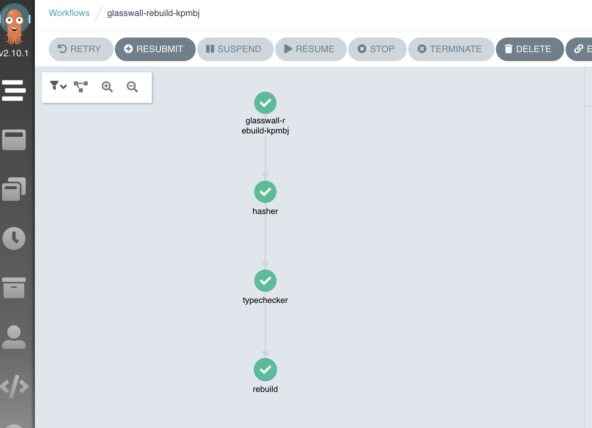
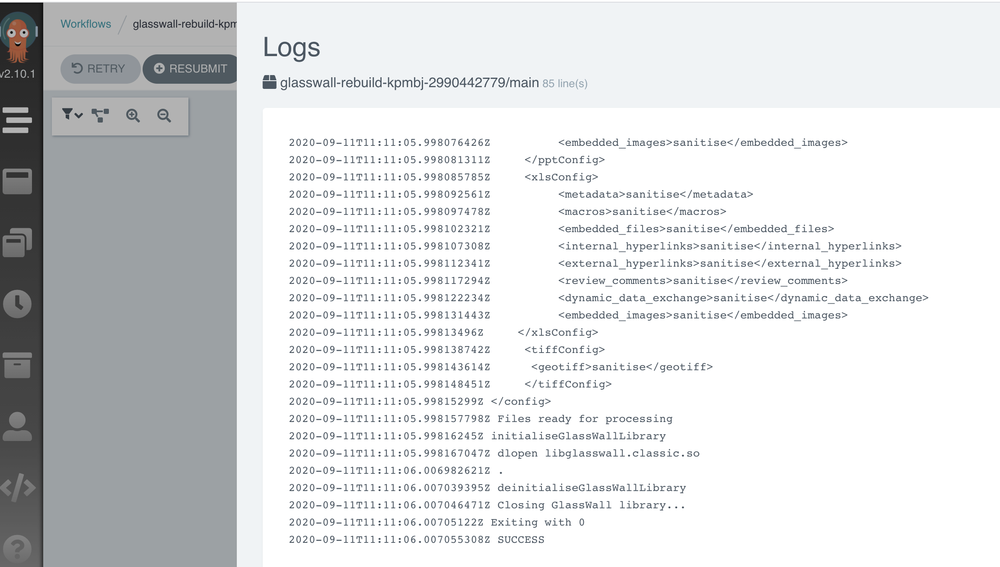

# Glasswall Rebuild usage with argo workflow and argo events

## Achitecture (taken from https://argoproj.github.io/argo-events/triggers/argo-workflow/)

Basically :

- Argo event will receive events from multiple possible sources (rabbitmq, minio, s3, ..)
- Once an event is received, it will trigger execution of a workflow, passing the filename to rebuild to that workflow
- The workflow will then be executed and rebuild the file

## Setup

- Install argo workflows and argo events following official documentation
- Setup argo events bus
- Setup Minio event source. Example manifest is in this repo : minio-eventsource.yml
- Setup Minio event sensor. Example manifest is in this repo : minio-event-sensor.yml (everything happens in the sensor, we can see that it will trigger the flow around line 35. and we are passing the notifications parameters to the flow. See from line 20)

## Workflow View

This is a simple workflow implemented for the PoC, the intermediate steps(hasher, file checker) now don't do anything it was just to present how the flow can be orchestrated.
In the image bellow we can see the execution and each pod logs on the UI

