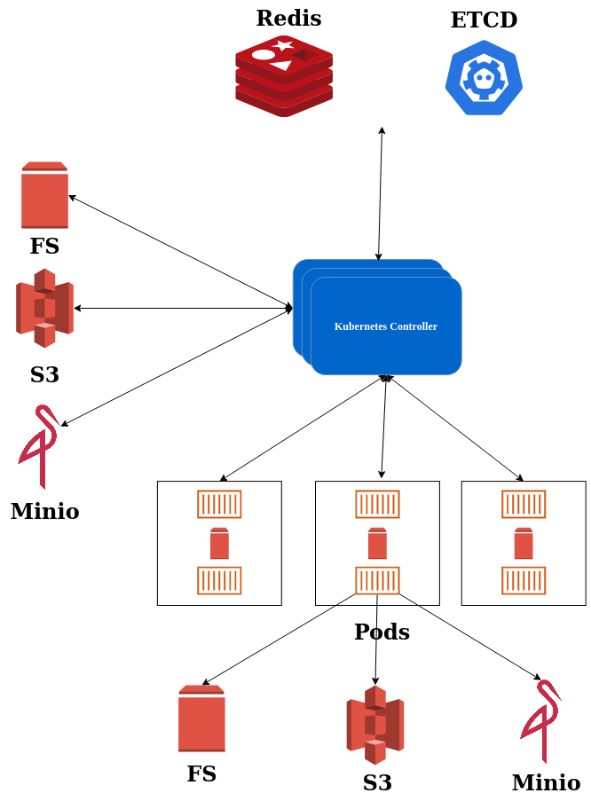
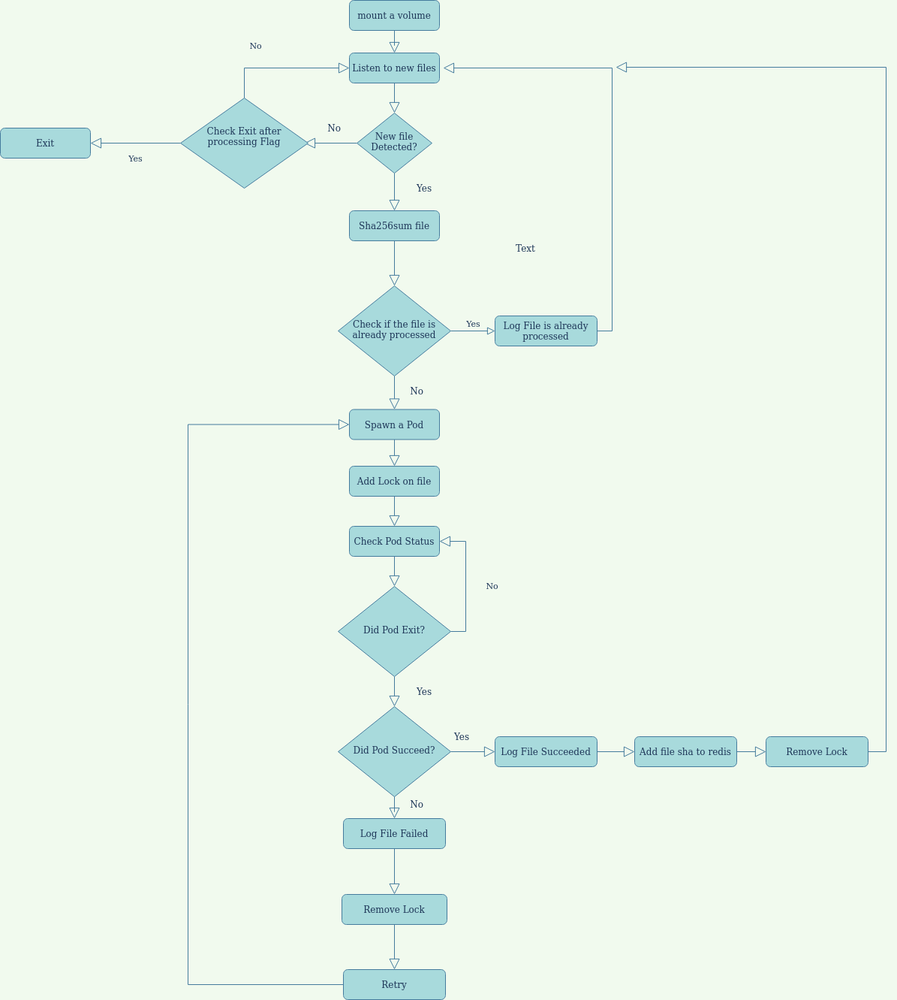

# k8 Glasswall Rebuild

### The project Requires Creating the following applications
1) K8s Controller.
2) File Uploader.
3) EFK Stack.

### Architecture Diagram

### K8s Controller Flow Chart

### Controller Responsabilities
1) takes an input driver it could be s3 path, or a filesystem path. or any input driver (extendable to any kind of paths).
2) evaluate each file checking it if it was already processed or not.
   1) if the file was processed. skip
   2) else spawn a new pod giving the pod the internal file link.
3) Open a file server if the files are in a volume attached on controller.
4) Takes an argument of How many parallel files should be processed at one time.
5) create a lock file with the file being processed and mark it as done in redis rebloom.
6) Takes an argument to keep watching on the folder or terminate when all files being processed are done.
7) implement a retry strategy on the files and takes the number of retries as an argument.
8) Listens to the status of the pod if completed and if failed so it could retry. and if succeed add the sha256 of the file to redis rebloom.
9) Logging that a file being processed and the status of the pod if failed or succeeded.

### FAQ
**Why Is a file Server necessary?**

If the cluster is a multi availability zones. mounting a volume between different availability zone will not
be possible. So to pass a file to the pod, we have to create a link and download it in initcontainer
before before processing. (This will be only necessary if the input source is a volume).

**Why Locking the file when processing?**

If we want to scale the Controller horizontal, that will result in multiple containers listening on the same folder. which might cause that the same file will be processing in two different pods. So disable that
we just create a lock file when a file is being to processed to prevent two workers working on the same file.
The lock will be removed when the processing is done.

**Why using redis/etcd?**

This is mainly for fault tolerance, Processes might crash and it will restart the controller listening to the folder again, reporting the status of a specfic file in the pipeline is really important.
as we don't want to process the same file twice, checking if the file system was already processed or not
in redis, i would use redis rebloom to use as a bloom filter for the files already being processed. by getting
the sha256 of the file and add it and check if present before spawning a new pod.

if I cannot use redis, I would use etcd and set the sha256 of the processed value there. and check by getting the value if it's present skip the file logging it's already processed else spawn a new pod
