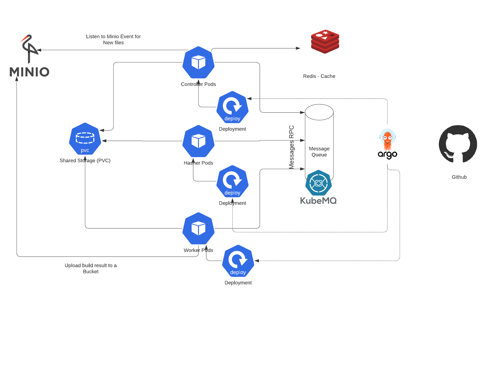
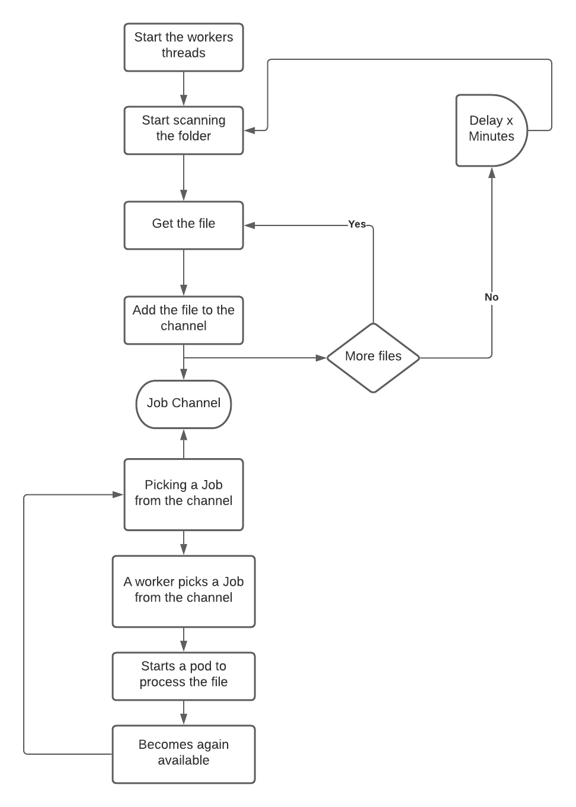
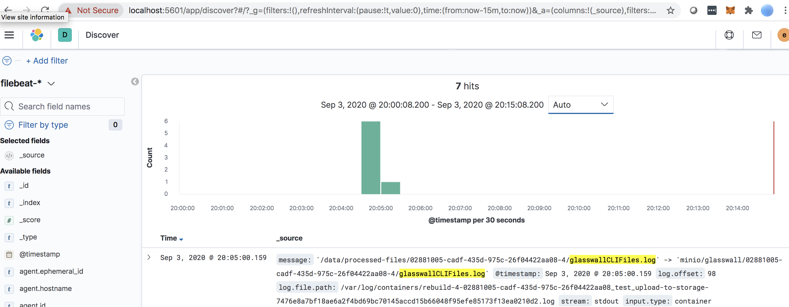
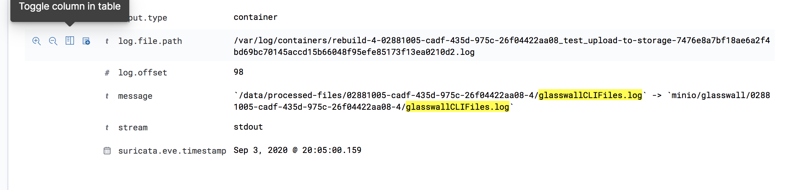

# Glasswall Rebuild

## Achitecture overview



The worker pod is made of 2 containers :

- Init container rebuilding the file
- An additionnal container moving the output file to the storage engine

## Controller flow



Based on our last discussion during there call (i understand better the requirement), and i think we should have the controller to consume the files from a queue/topic, and also controls the result of pod execution in order to report it back on a queue/topic in order to be consumed.
Savind state and sha signature of each file is also necessary in order to avoid duplicates. Will enhance the flow in that direction 

## Build

This project uses 3 docker images (They are already builded and pushed to dockerhub on my account - azopat. But you can build them as well and use your own images)
- The main controller, which is this actual code. To build the image, run the command
	- docker build -t <image_name> .

- The image used to upload files to Minio
	- cd minio
	- docker build -t <minio_upload_image_name> .

- The image is the glasswall rebuild engine
	- We use another repo to build it so to build it you need to clone that repo first
	- git clone https://github.com/filetrust/Glasswall-Rebuild-SDK-Evaluation.git /<rebuild_engine_clone_location>
	- cp rebuild-engine/* /<rebuild_engine_clone_location>/Linux/
	- cd <rebuild_engine_clone_location>/Linux
	- docker build -t <rebuild_engine_image_name> .


## How to Setup the solution
**Local shared drive drive**

- Create the Persistent volume : kubectl apply -f k8s/pv.yml (Make sure the path and hostname are valid in your environment)
- Create the Persistent volume claim : kubectl apply -f k8s/pvc.yml

**Minio**

- Setup Minio following the procedure explained here : https://github.com/filetrust/k8-glasswall-rebuild/blob/master/upwork-devs/faisal-adnan/POC_Howto.md

**Logging**

- Setup Elastic for logging following the procedure explained here : https://github.com/filetrust/k8-traffic-generator/blob/master/upwork-devs/faisal-adnan/elk/HOWTO-ELK.md
- You don't need to do anything else, beat is configured to scan all the containers logs in the cluster and push the logs to elastic. So once you do above setup and the pods are running, you are good to go.

**Upload files**

- Copy the files you want to rebuild the local share

**Controller**

- Verify the variables inside k8s/controller-dep.yml and adjust accordingly
- Deploy the controller kubectl apply -f k8s/pvc.yml


Pod List
----------
```
kubectl -n test get pods
NAME                                             READY   STATUS    RESTARTS   AGE
gw-controller-6b786f67cd-rb5d6                   1/1     Running   0          75m
rebuild-1-541d95bd-26bb-493f-96aa-7b169066a6e9   1/1     Running   0          75m
rebuild-2-541d95bd-26bb-493f-96aa-7b169066a6e9   1/1     Running   0          75m
rebuild-3-541d95bd-26bb-493f-96aa-7b169066a6e9   1/1     Running   0          75m
rebuild-4-541d95bd-26bb-493f-96aa-7b169066a6e9   1/1     Running   0          75m
```

PS : I intensionnally added for loop and unlimited sleep to keep the pods running. But the target is to not have them and the pod would be completed.

Controller logs
--------------
```
2020/08/24 09:13:32 init worker
2020/08/24 09:13:32 init worker
2020/08/24 09:13:32 init worker
2020/08/24 09:13:32 init worker
2020/08/24 09:13:32 init worker
2020/08/24 09:13:32 Scan processor on folder /tmp/files
2020/08/24 09:13:32 File found : Complete+works+of+shakespeare+hidden+zip_Polyglot_image.jpg
2020/08/24 09:13:32 File found : MacroRunCalculator.docm
2020/08/24 09:13:32 File found : Opens+calculator+app_macro_MS+excel+2003+and+later.xlsm
2020/08/24 09:13:32 File found : PDF_with_javascript.pdf
2020/08/24 09:13:32 Processing file : PDF_with_javascript.pdf
2020/08/24 09:13:32 Processing file : Complete+works+of+shakespeare+hidden+zip_Polyglot_image.jpg
2020/08/24 09:13:32 Processing file : MacroRunCalculator.docm
2020/08/24 09:13:32 Processing file : Opens+calculator+app_macro_MS+excel+2003+and+later.xlsm
```

A rebuild Pod Log
------
```
*************************************************************
START LOGGING Mon Aug 24 09:13:37 2020

SOFTWARE VERSION 1.99
*************************************************************
*************************************************************
Process Settings
*************************************************************
*************************************************************
<?xml version="1.0" encoding="utf-8"?>
<config><pdfConfig><watermark>Glasswall Approved</watermark>
<metadata>sanitise</metadata>
<javascript>sanitise</javascript>
<acroform>sanitise</acroform>
<actions_all>sanitise</actions_all>
<embedded_files>sanitise</embedded_files>
<external_hyperlinks>sanitise</external_hyperlinks>
<internal_hyperlinks>sanitise</internal_hyperlinks>
<embedded_images>sanitise</embedded_images>
<value_outside_reasonable_limits>allow</value_outside_reasonable_limits>
<retain_exported_streams>allow</retain_exported_streams>
</pdfConfig>
<wordConfig><metadata>sanitise</metadata>
<macros>sanitise</macros>
<embedded_files>sanitise</embedded_files>
<review_comments>sanitise</review_comments>
<internal_hyperlinks>sanitise</internal_hyperlinks>
<external_hyperlinks>sanitise</external_hyperlinks>
<dynamic_data_exchange>sanitise</dynamic_data_exchange>
<embedded_images>sanitise</embedded_images>
</wordConfig>
<pptConfig><metadata>sanitise</metadata>
<macros>sanitise</macros>
<embedded_files>sanitise</embedded_files>
<review_comments>sanitise</review_comments>
<internal_hyperlinks>sanitise</internal_hyperlinks>
<external_hyperlinks>sanitise</external_hyperlinks>
<embedded_images>sanitise</embedded_images>
</pptConfig>
<xlsConfig><metadata>sanitise</metadata>
<macros>sanitise</macros>
<embedded_files>sanitise</embedded_files>
<internal_hyperlinks>sanitise</internal_hyperlinks>
<external_hyperlinks>sanitise</external_hyperlinks>
<review_comments>sanitise</review_comments>
<dynamic_data_exchange>sanitise</dynamic_data_exchange>
<embedded_images>sanitise</embedded_images>
</xlsConfig>
<tiffConfig><geotiff>sanitise</geotiff>
</tiffConfig>
</config>

*************************************************************
==00000== Found File /tmp/files/process-file-1/Complete+works+of+shakespeare+hidden+zip_Polyglot_image.jpg    Passed

*************************************************************
STOPLOGGING Mon Aug 24 09:13:37 2020

Duration  0hrs  0mins  0secs

*************************************************************
```


Minio Interface - we see the files processed
------


Some Logs on elastic
------





